# VarStore 设计文档

## 1. 概述

`VarStore` 是 OnDemand 系统的**核心变量值存储模块**，负责管理 10 万+ 变量的内存分配、读写、脏标记追踪。

设计目标：
- **一写多读**：同一变量同一时刻只有一个写端，但可以有多个读端并发读取
- **无锁读**：读操作不阻塞写操作，写操作不阻塞读操作
- **批量操作**：支持批量注册、批量写入、批量零拷贝读
- **动态扩容**：变量数据大小可以在运行时扩展
- **64 字节对齐**：避免 CPU cache line false sharing

---

## 2. 整体架构

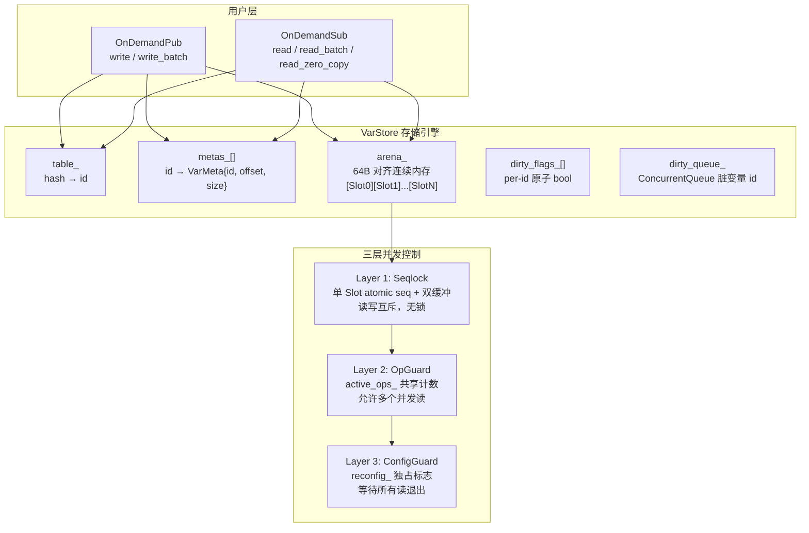

---

## 3. 内存布局

### 3.1 Slot 内部结构

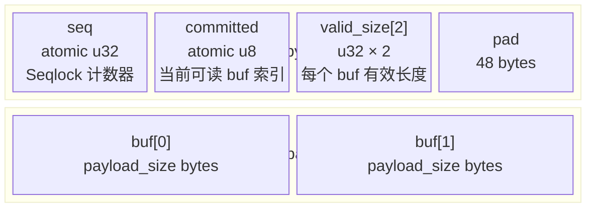

| 字段 | 作用 | 为什么这样设计 |
|------|------|----------------|
| `seq` | Seqlock 计数器，奇数=写入中，偶数=稳定 | 无锁读的关键，读端通过检查 seq 判断数据是否有效 |
| `committed` | 指向当前可读的 buf (0 或 1) | 双缓冲切换，写端写 `1-committed`，写完后翻转 |
| `valid_size[2]` | 每个 buf 的实际有效数据长度 | 支持变长写入，读端知道要读多少字节 |
| `alignas(64)` | 64 字节对齐 | 一个 Slot 独占一个 cache line，避免 false sharing |

### 3.2 Arena 全局布局

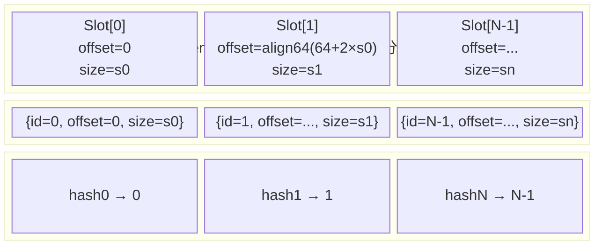

---

## 4. 三层并发控制模型

这是 VarStore 最核心的设计。三层各司其职：

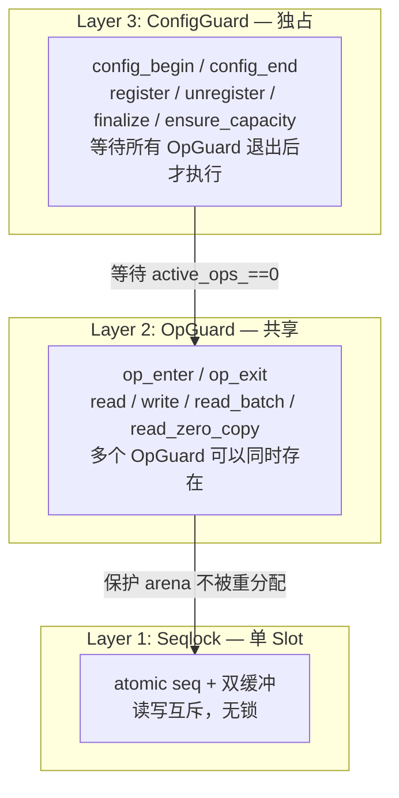

### 4.1 Layer 1: Seqlock（单 Slot 读写互斥）

让读端和写端可以并发访问同一个 Slot，无需 mutex。

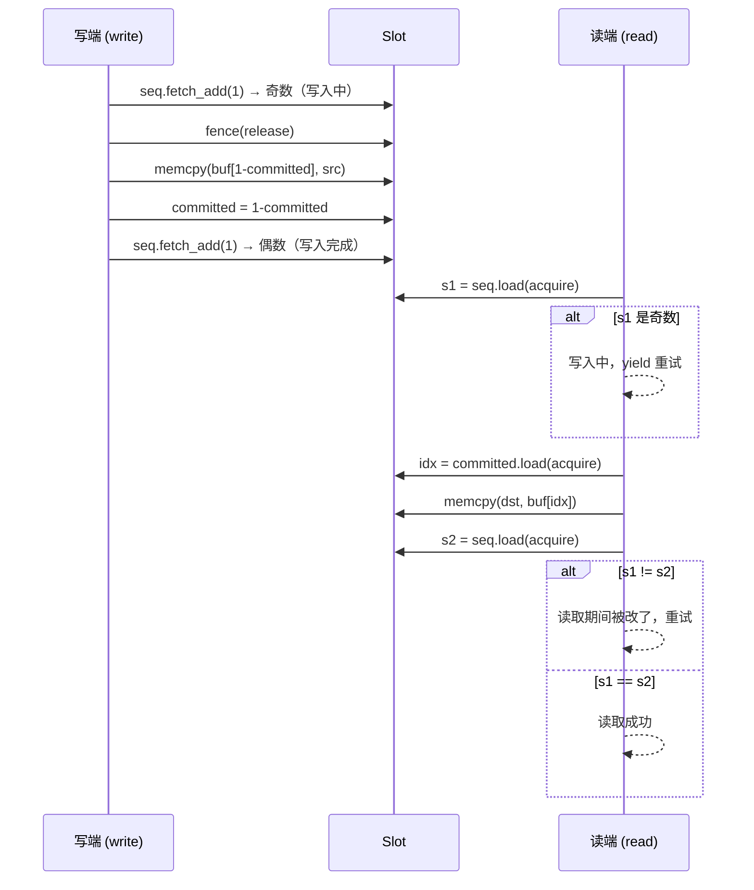

### 4.2 Layer 2: OpGuard（读操作保护）

防止读操作在执行期间，arena 被重新分配（`finalize` / `ensure_capacity`）。

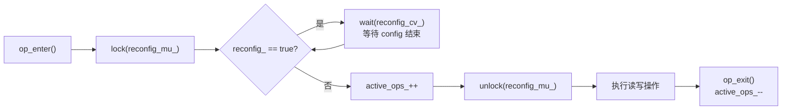

多个 OpGuard 可以同时存在（`active_ops_` 可以 > 1），它们共享读访问。

### 4.3 Layer 3: ConfigGuard（配置操作保护）

确保 register / unregister / finalize / ensure_capacity 执行时，没有读操作在进行。

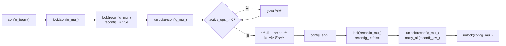

### 4.4 为什么需要互斥锁？—— TOCTOU 竞态防护

`reconfig_` 是 atomic bool，但仅有它不够。**没有互斥锁的竞态：**

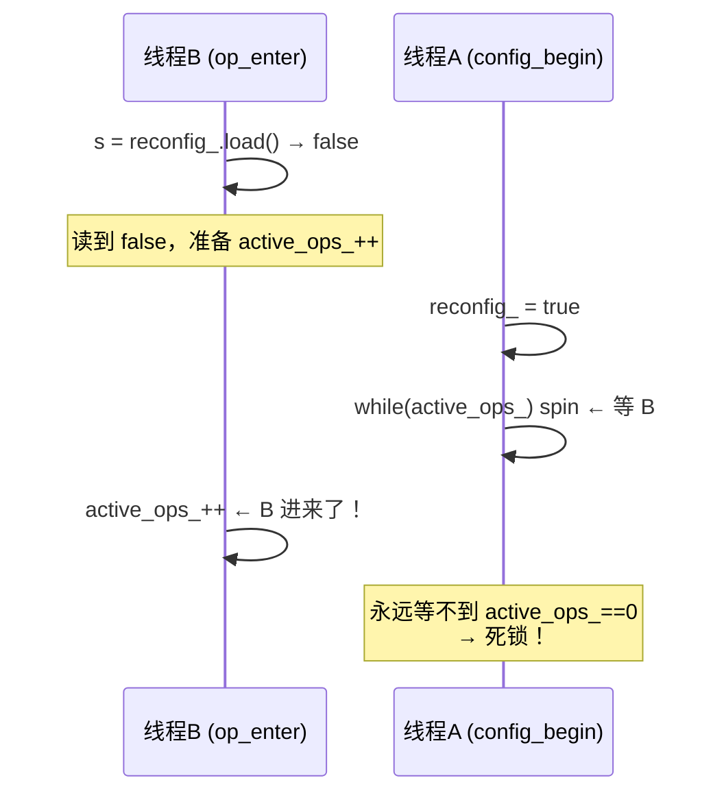

**有互斥锁：**

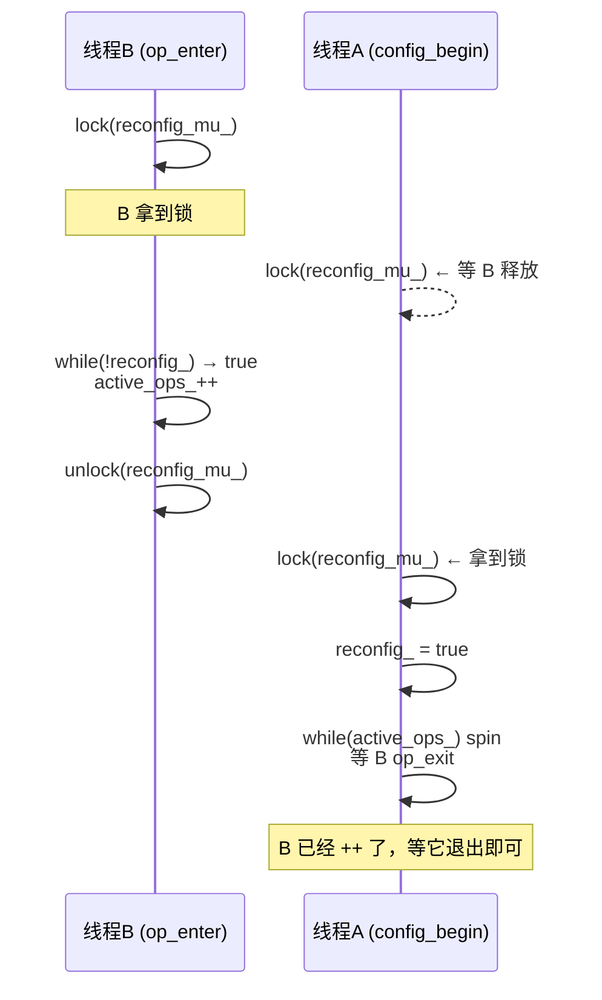

互斥锁保证"检查 `reconfig_`"和"`active_ops_++`"是原子的，A 不可能在中间插入。

### 4.5 完整的锁交互时序

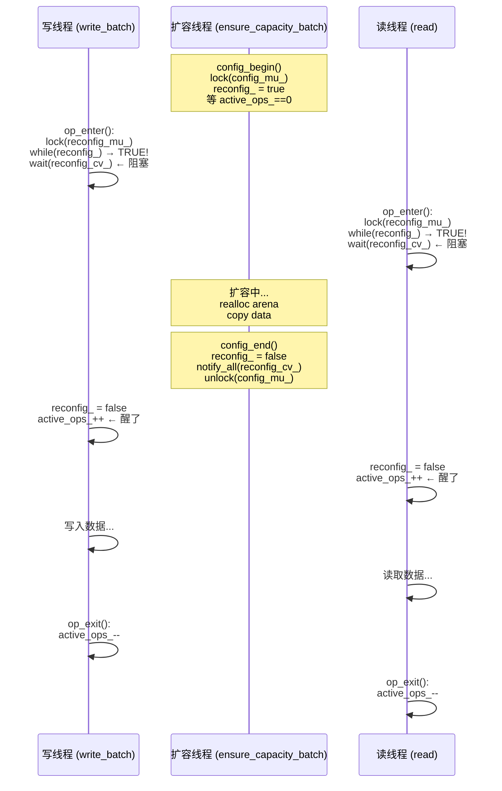

---

## 5. 变量生命周期

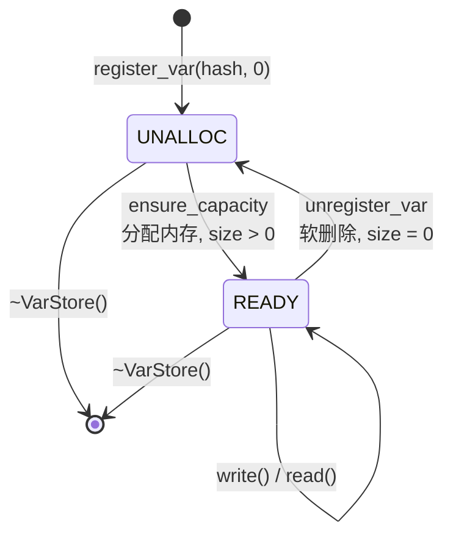

- **UNALLOC** (`size=0`)：已注册但未分配内存，`write()` 返回 `NOT_READY`，`read()` 返回 `nullptr`
- **READY** (`size>0`)：内存已分配，可正常读写
- **软删除**：`unregister_var` 将 `size` 置 0，不释放 arena（ID 不变，不重排）

---

## 6. 写入路径

### 6.1 单变量写入：`write(id, src, actual_size)`

```mermaid
flowchart TD
    A["write(id, src, actual_size)"] --> B{"src == null || size == 0?"}
    B -->|是| C["return FAILED"]
    B -->|否| D["OpGuard 加锁"]
    D --> E{"arena 有效 && id < var_count?"}
    E -->|否| F["return FAILED"]
    E -->|G{"metas_[id].size == 0?"}
    G -->|是| H["return NOT_READY"]
    G -->|否| I{"actual_size <= size?"}
    I -->|是| J["seqlock 写入 buf[1-committed]<br/>dirty_flags_[id] = true<br/>dirty_queue_.enqueue(id)"]
    J --> K["return SUCCESS"]
    I -->|否| L["OpGuard 解锁"]
    L --> M["ensure_capacity(id, actual_size)<br/>ConfigGuard: 扩容 arena"]
    M --> N["continue → 回到循环顶部"]
    N --> D
```

### 6.2 批量写入：`write_batch(ids, datas, sizes, count)`

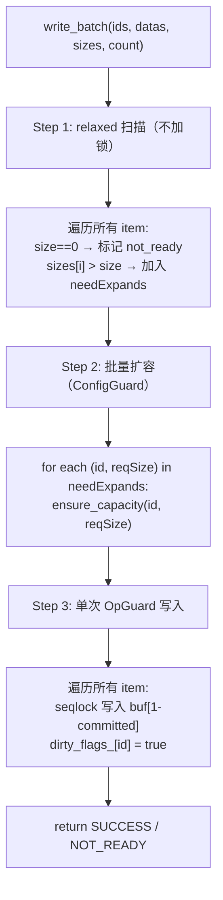

**Step 1 为什么不加锁？**
- `metas_[id].size` 是 `uint32_t`，relaxed load 是原子的
- 最坏情况读到旧值，Step 3 在 OpGuard 内兜底
- 好处：不被 ConfigGuard 阻塞，30 万变量扫描瞬间完成

---

## 7. 读取路径

### 7.1 带 memcpy 的安全读：`read(id, dst)`

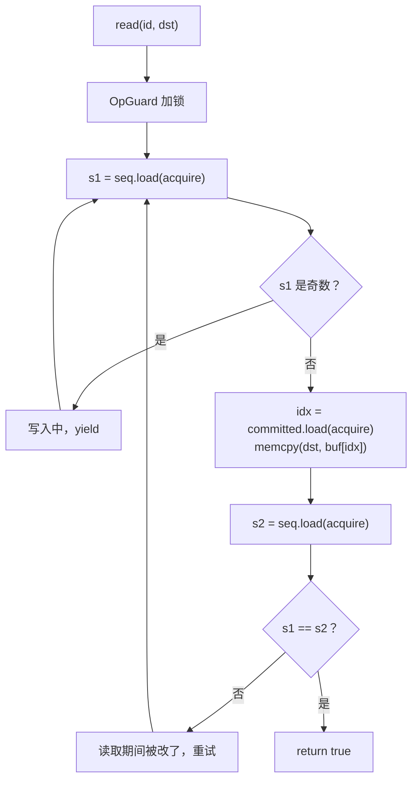

### 7.2 零拷贝读：`read_zero_copy(id)`

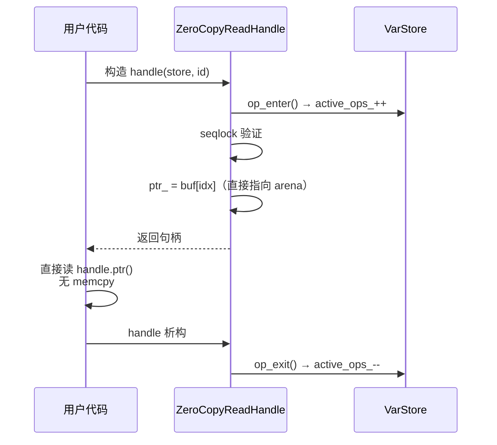

**注意**：持有 `ZeroCopyReadHandle` 期间，`config_begin` 会被阻塞（因为 `active_ops_ > 0`）。用完立即释放。

---

## 8. Dirty 追踪机制

用于 OnDemand 的增量发布：只发布有新数据的变量。

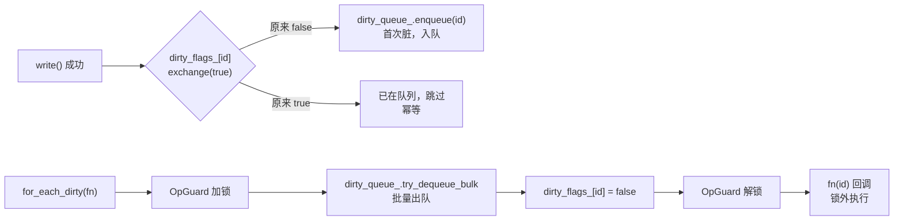

**幂等入队**：同一个变量多次写入只入队一次，队列不膨胀。

---

## 9. 动态扩容

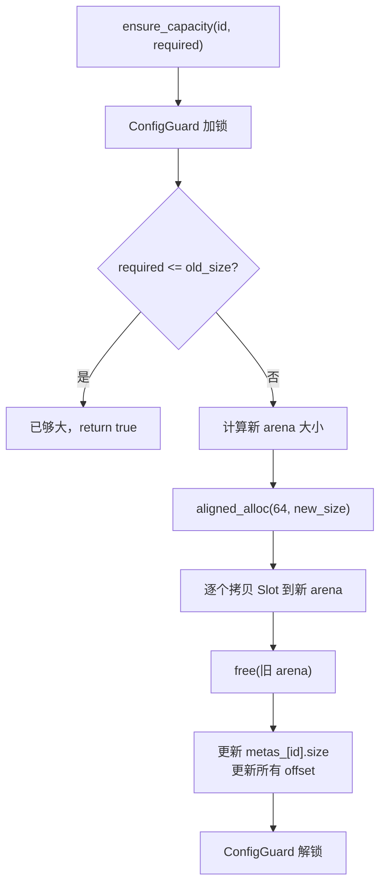

批量扩容 `ensure_capacity_batch` 逻辑相同，一次 ConfigGuard 处理所有变量，只做一次 arena 重分配。

---

## 10. 设计权衡总结

| 决策 | 优点 | 代价 |
|------|------|------|
| Seqlock 无锁读 | 读不阻塞写，写不阻塞读 | 读端可能重试；只能单写 |
| 双缓冲 | 写端不阻塞读端 | 每个变量 2 倍内存 |
| 64 字节对齐 | 无 false sharing，SIMD 友好 | 小变量浪费空间（最小 128B/Slot） |
| 软删除 (size=0) | ID 稳定，无需重排 | arena 只增不减 |
| ConfigGuard + OpGuard | 配置和读写互斥，实现简单 | ConfigGuard 期间所有读写阻塞 |
| 互斥锁 + 条件变量 | 防止 TOCTOU 竞态 | 每次 op_enter 有锁开销（很小） |
| relaxed load 扫描 | 批量写不被 ConfigGuard 阻塞 | 可能读到旧值，需兜底 |
| dirty 幂等入队 | 队列不膨胀 | exchange 有原子开销 |
